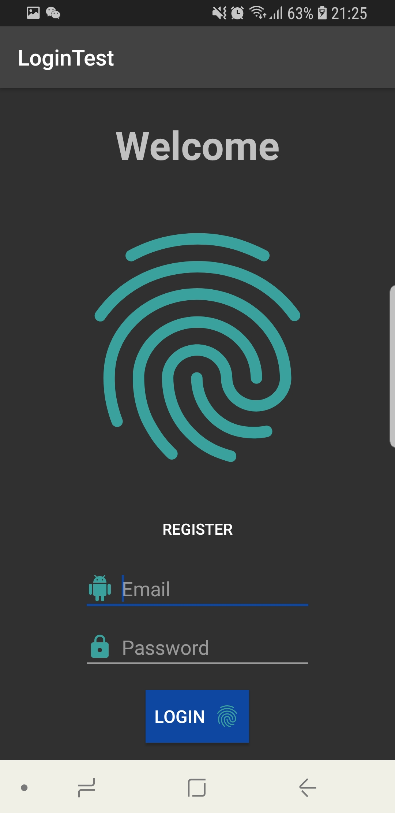
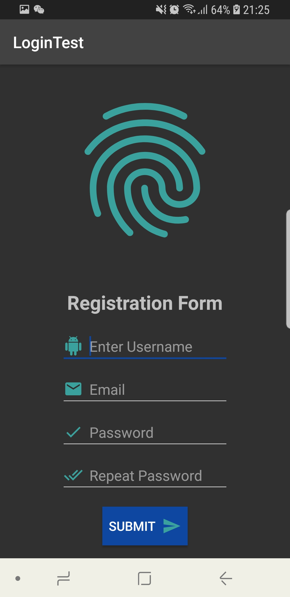
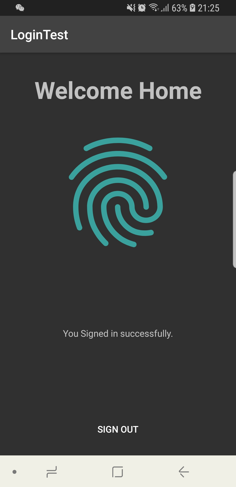

# LoginTest Android App

This is a simple android app that uses [Google Firebase](https://firebase.google.com/) for authentication.

**Sample Screenshots:**

  

**Note:**

As in the current state the app will not run successfully, since the Google google-services.json file was removed.
